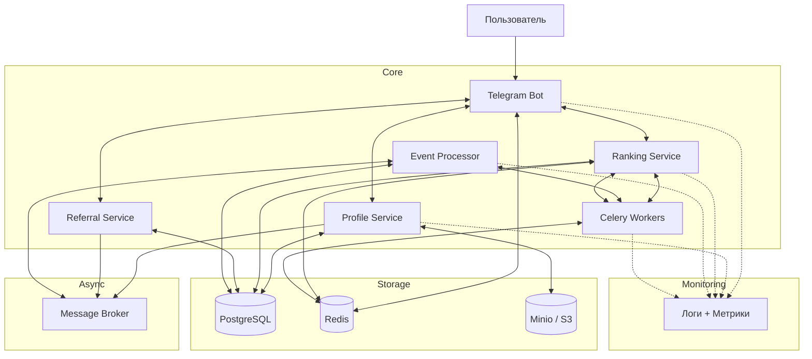

```mermaid
graph TB
    User[Пользователь]

    subgraph Core
        Bot[Telegram Bot]
        Profile[Profile Service]
        Ranking[Ranking Service]
        Referral[Referral Service]
        EventProc[Event Processor]
        Celery[Celery Workers]
    end

    subgraph Storage
        DB[(PostgreSQL)]
        Redis[(Redis)]
        S3[(Minio / S3)]
    end

    subgraph Async
        Broker[Message Broker]
    end

    subgraph Monitoring
        Mon[Логи + Метрики]
    end

    User --> Bot

    Bot <--> Profile
    Bot <--> Ranking
    Bot <--> Referral
    Bot <--> Redis

    Profile <--> DB
    Profile <--> S3
    Profile --> Broker

    Ranking <--> DB
    Ranking <--> Redis
    Ranking <--> Celery

    Referral <--> DB
    Referral --> Broker

    EventProc <--> Broker
    EventProc <--> DB
    EventProc <--> Celery

    Celery <--> Ranking
    Celery <--> Redis
    Bot -.-> Mon
    Profile -.-> Mon
    Ranking -.-> Mon
    EventProc -.-> Mon
    Celery -.-> Mon
```
