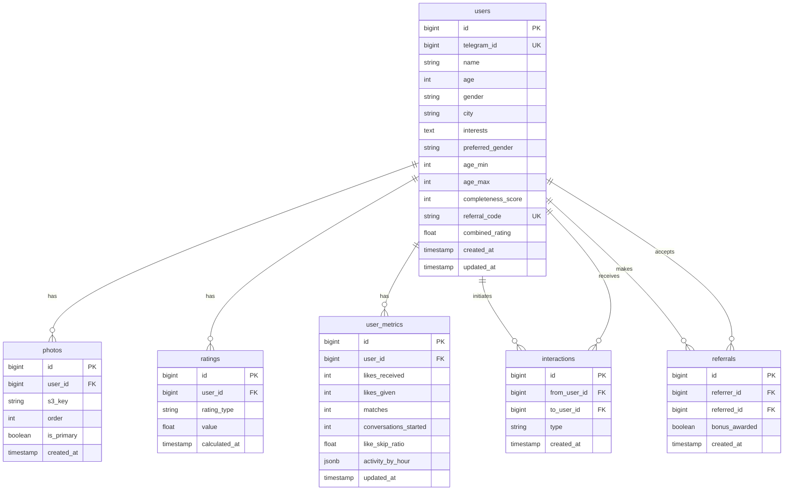

```mermaid
erDiagram
    users {
        bigint id PK
        bigint telegram_id UK
        string name
        int age
        string gender
        string city
        text interests
        string preferred_gender
        int age_min
        int age_max
        int completeness_score
        string referral_code UK
        float combined_rating
        timestamp created_at
        timestamp updated_at
    }

    photos {
        bigint id PK
        bigint user_id FK
        string s3_key
        int order
        boolean is_primary
        timestamp created_at
    }

    ratings {
        bigint id PK
        bigint user_id FK
        string rating_type
        float value
        timestamp calculated_at
    }

    user_metrics {
        bigint id PK
        bigint user_id FK
        int likes_received
        int likes_given
        int matches
        int conversations_started
        float like_skip_ratio
        jsonb activity_by_hour
        timestamp updated_at
    }

    interactions {
        bigint id PK
        bigint from_user_id FK
        bigint to_user_id FK
        string type
        timestamp created_at
    }

    referrals {
        bigint id PK
        bigint referrer_id FK
        bigint referred_id FK
        boolean bonus_awarded
        timestamp created_at
    }

    users ||--o{ photos : "has"
    users ||--o{ ratings : "has"
    users ||--o{ user_metrics : "has"
    users ||--o{ interactions : "initiates"
    users ||--o{ interactions : "receives"
    users ||--o{ referrals : "makes"
    users ||--o{ referrals : "accepts"
```
